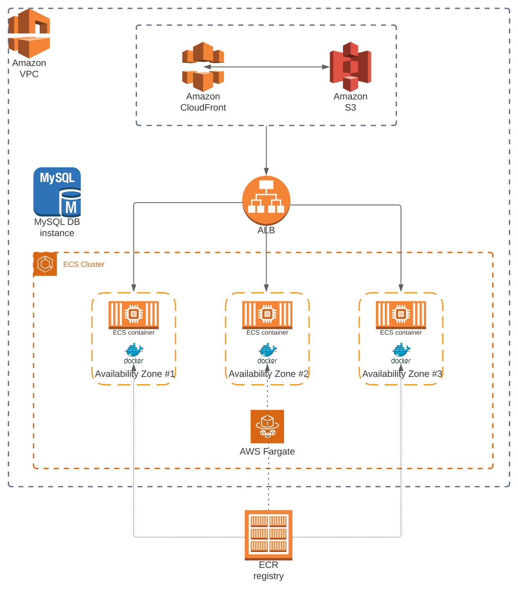

# Empatica assignment #

The aim of the project is to deploy a web application composed by
* **backend** written in go that expose a REST api
* **webapp** written in angular that consume the REST api

Part of the project is also provisioning a **MySql database** on AWS RDS.

## Architecture ##



- Static contents are delivered into an **s3 bucket**, accessible through a **CloudFront Distribution**.
- The backend server run into tasks, within an **ECS cluster on FARGATE**.
- An **application load balancer (ALB)** manages the traffic from the frontend app to the ECS cluster, balancing them to three tasks running on 3 different availability zones.

### Zero Downtime ###

This architecture allows the **rolling update (ECS) deployment** type: when a new deployment occurs, old task are killed if and only if the new deployment succeed.

The load balancer, once the healtchecks are done on new containers, unregister the old containers from the target group, in order to corretly route the traffic to new ones.

This way, there is no downtime when a new backend version is deployed.

## Run ##

To run the project, we need to provision the infrastructure and then execute the deployment.

### Provisioning AWS infrastructure through Terraform ###

Terraform scripts are published into the _terraform_ folder.

#### Configure ####

Before running the terraform script, an aws access key and aws access key should be provided into the _main.tf_ file.

Credentials will be used to access the aws account where the infrastructure should be deployed.

(Please, contact me if you need credentials to run on a test account)

#### Requirements ####

* Terraform

#### Execute ####

```shell
cd terraform
terraform init
terraform apply
```

### Deploy ###

Once the infrastructure has been created, we can deploy the application.

#### Configure ####

Before running the deploy script, please update the deploy/setEnv.sh with your aws account id.

The docker image is built on your machine and then pushed to the ECR registry using the AWS cli.

#### Requirements ####

- AWS CLI (configured with the AWS IAM user used by Terraform)
- Docker
- Angular cli (v9.x.x recommended or higher)
- Node (v12.x.x recommended or higher)

#### Execute ####

```shell
cd deploy
./deploy.sh
```

## Test Zero Downtime ##

To test the Zero Downtime you can simply run the script **./deploy/be-deploy.sh**

A new docker image will be built and pushed to the registry and then, the **be_service** is update in order to provision new tasks.

During the deployment, the application will be still runnning because ECS will keep running old tasks until new ones are ready.

Then, the load balancer will switch the traffic to new containers and old ones will be killed.

